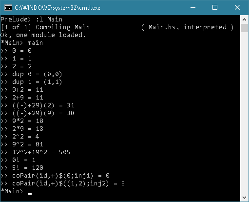

# Haskell-Nonsense

[ETCS 集合論](https://ncatlab.org/nlab/show/fully+formal+ETCS)における、自然数同士の加法や乗法、自然数の階乗の定義の際に必要な射の純粋圏論的な構成方法について、単なる興味から実際に Haskell の関数を使って行ってみただけの、実用性皆無のナンセンス。

僕自身まだ詳しくはわかっていませんが、ホモトピー型理論 (HoTT) の上に展開されることになる集合論も、ZFC ではなく ETCS 寄りの圏論的なプロパティから集合を構成していく集合論らしく ([参照](https://ncatlab.org/nlab/show/structural+set+theory#InHomotopyTypeTheory))、ETCS を理解していて損はないのかなということで、ETCS の学習のちょっとした手助けにでもなれば。

ちなみに、(理想化された) Haskell の型とその間の関数の成す圏は初等トポスではないため、ETCS で目玉となる「任意のトポスについて一般に行うことが可能な部分対象分類子の公理をメインに用いた、トポスの内部論理の意味 (Semantics) の部分となる
∧:Ω×Ω→Ω, ⇒:Ω×Ω→Ω, ∀_A:(Ω^A)→Ω といった諸々の射たちの構成」と、そこからの「それらの組み合わせとして構成される変数が全て括り出されている抽象的な論理式を意味する射に沿って部分対象分類子を引き戻すことで、置換公理を一切持ち出すことなしに構成されることになる複雑な部分対象の構成」までは、残念ながら Haskell で具体的に実演することはできませんでした。

### Interactive モードでの実行結果

## 補足

### 関数の定義について

圏論において、「2つの対象の要素間の対応の規則を与えたときに、合成の規則がちょうどそれになるような射が存在すること」というのは、ある特定のプロパティを満たす圏の上で証明される一つの定理であり、公理ではない。

「射 (arrow)」というのは、圏の持つ合成演算の存在によって初めてその圏の中において写像のように振舞うことができるだけで、それ自体は文字通りあくまで単なる矢印でしかなく、入力される要素がどのように出力されるかを定めたからといって、一般に圏論的にはそういった射がどこからともなく生えてくることは初めから保証されていない。
それが、いわゆる「point-free」スタイルでの関数の定義を好んで採用している理由でもある。

ここで、(関手や自然変換までをも自由に扱えない) ETCS においては、「pair(f,g)」「coPair(f,g)」「recurs(x,f)」「(f+++g)」といった根源的なものについて、x,f,g が切り離された「pair」「coPair」「recurs」「(+++)」をそれぞれ一つの射として扱うことはできないため、それらの定義についてはその限りではない。

### Bool' 型について

このソースコードの中で定義している型 Bool' はあくまで単なる真偽値からなる型であり、トポスが持つ俗に真理値対象 (object of truth values) と呼ばれる「部分対象分類子が属する対象 Ω 」という意味ではない。

具体的には公理的に圏を考える場合、その圏の持つプロパティが先行することになる。例えばトポスにおいて、「部分対象分類子を持つ」というのは (部分対象分類子の存在ではなく冪対象の存在を公理で認める流儀もあるが) 通常公理的に認めているため、部分対象分類子 true とその要素が属す空間 Ω=cod(true) それ自体は、トポスの公理を満たす ETCS による集合論を基礎に数学を行っているのであれば、(ちょうど ZFC による数学で、どこからともなく空集合 ∅ を持ち出してきているのと同様に) 当然無条件に持ち出してくることが可能である。しかしながら、トポスの一般論を考える場合、true 以外に Ω がどういった要素を持つのかまでは具体的には決定しない。

わかりやすく言い換えると、トポスの公理である「圏である」「全ての有限極限を持つ (終対象と全ての引き戻しを持つ)」「カルテシアン閉である」「部分対象分類子を持つ」という公理を使った演繹によって、「全ての有限余極限を持つ」ということは証明できても「終対象同士の余積対象 (1+1) と 対象 Ω の間に同形射が存在する」ということまでは一般に証明できない。第一にそれが成り立ってしまったら、全てのトポスの内部論理が2値論理ということになり、論理を展開する"一般的な"枠組みの役割を果たせていない。但し、トポスの公理に「非自明である」「well-pointed である」「自然数対象を持つ」「選択公理を満たす」が加えられた ETCS の公理系においては、そのことを証明することができる。

そして直観に反するかもしれないが、Ω がどういった要素を持つのかが具体的全く分からなくても、トポスの公理さえあれば必要な論理演算は漏れなくすべて一律に定義されることになる。
